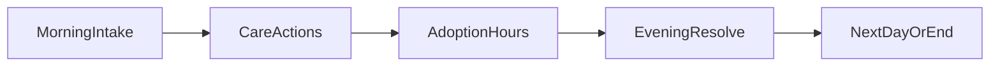

# Pawfect Shelter — Design Plan

## Pitch

A cozy **roguelike shelter sim** where you run an animal shelter: take in pets under limited capacity, keep them healthy, and **match them to the right adopters**. Each run is one season. Survive rising pressure, grow your reputation, and send pets home.

This replaces the old *Pawfect Defense* combat deck-builder (Unity assets remain under `Assets/` as legacy). The playable game lives in **`web/`**.

---

## Why this shape (A + B)

| Pillar | What it is | Why it belongs |
|--------|------------|----------------|
| **A — Matching** | Score pets ↔ adopters by traits, needs, dealbreakers | The fantasy: “the right home” |
| **B — Shelter management** | Kennels, food, staff energy, stress, reputation | The stakes: overcrowding, burnout, bad press |

Matching without management is a puzzle with no pressure. Management without matching is a spreadsheet. Together they create a roguelike: every accept/reject and every placement reshapes the run.

---

## Platform choice (least work for you)

**Browser prototype (`web/`)** — not Unity.

- No Unity Hub, scene wiring, prefabs, or iOS toolchain
- Open the PR preview or run `npm install && npm run dev` and play
- Iterate design in hours instead of Editor sessions
- Unity combat code stays as reference; port later only if you want App Store

---

## Core loop (one day)



1. **Morning intake** — Strays / transfers arrive. Accept (uses a kennel) or turn away (small reputation cost). Overfilling is not allowed; full shelter forces hard choices.
2. **Care** — Spend **staff energy** and **supplies** to Feed, Play, Train, or Treat. Low care → stress rises → harder matches and return risk.
3. **Adoption hours** — Visitors arrive with preferences. You assign pets. Match quality drives money, reputation, and return chance.
4. **Evening** — Stress ticks, random events resolve, day advances. Boss-style days (inspection, adoption fair) appear late in the run.

---

## Run structure (roguelike)

- **Length:** 10 days (MVP). Later: acts / difficulty modifiers.
- **Win:** Reach Day 10 with reputation ≥ 40 and ≥ 6 successful adoptions.
- **Lose:** Reputation hits 0, or shelter collapses (all pets Critical stress while full).
- **Procedural content:** Pets, adopters, and events reseed each run.
- **Relics:** Permanent-for-the-run shelter upgrades (extra kennel, treat bowl, foster network, etc.), offered after strong days / events.
- **Meta (later):** Unlock starting relics, kennel skins, pet species.

---

## Data model (MVP)

### Pet
- Species: Dog | Cat | Rabbit | Bird
- Size: S | M | L
- Energy: Calm | Moderate | High
- Traits: `kidFriendly`, `allergySafe`, `needsYard`, `trained`, `specialNeeds`
- Stress: 0–3 (Calm → Anxious → Stressed → Critical)
- Days in shelter (longer → slight stress creep)

### Adopter
- Must-haves / nice-to-haves / dealbreakers (subset of pet traits + size/energy)
- Patience (affects “stretch” match tolerance)
- Home: Apartment | House | Farm

### Shelter
- Kennels (capacity), Supplies, Staff energy/day, Reputation (0–100), Gold
- Relics list
- Pets currently housed

### Match grades
| Grade | Effect |
|-------|--------|
| Perfect | +rep, +gold, never returns |
| Good | +rep, +gold |
| Stretch | small +gold; chance of return next day |
| Bad | refused or instant return + reputation hit |

---

## Events (examples)

- **Donation Drive** — +supplies / gold
- **Mystery Illness** — pick a pet to Treat or lose reputation
- **City Inspection** — if any Critical stress pets, big rep hit; else relic offer
- **Viral Post** — next day’s adopters are pickier but pay more
- **Foster Offer** — free one kennel for 2 days (relic-like)

---

## What we keep from the old project

- Cozy pet fantasy, breed personality, relic naming vibes
- Run → procedural days → rewards → meta progression spine
- iOS-friendly portrait UX ideas for a later Unity/mobile port

## What we drop (for now)

- Turn-based combat, energy-for-attacks, Animal Control enemies
- Card hand / deck piles as the primary verb
- Unity scene pipeline as the daily driver

---

## Implementation status

| Area | Status |
|------|--------|
| GDD (this doc) | Done |
| Web MVP loop | In `web/` |
| Art / audio | CSS + emoji placeholders (replaceable) |
| Meta progression | Stub / later |
| Unity port | Out of scope until loop is fun |

---

## How to play (dev)

```bash
cd web
npm install
npm run dev
```

Open the printed local URL. Start a run from the title screen.
